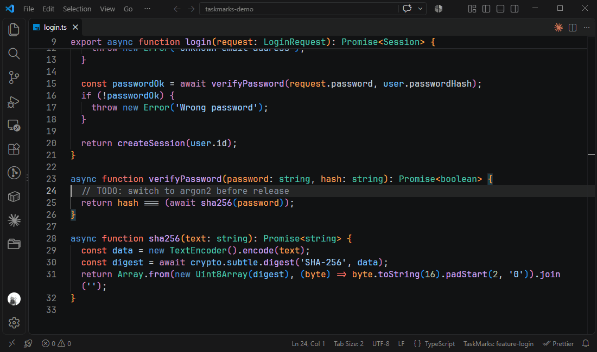

# Taskmarks

VSCode Extension - Persist bookmarks for different tasks.

On big projects, coming back to a topic that I did not touch for some time, I often need time to 'find the right places'. Taskmarks makes it possible to keep those old bookmarks, and go back to them, whenever I need them.

New topic - just add a new Task (Task == collection of bookmarks, belonging to a topic) and keep them forever.

Or copy a Task and share it with your co-workers. Or create a new one, to tell him or her: 'Please look here and here. Do we have a problem? / Could you please ...'

_A first shot of a demo - a better one will follow._

## Getting started

1. Put the cursor on a line and press `Alt+Shift+M` - a bookmark appears next to the line number. Your marks belong to the task shown in the status bar (`TaskMarks: default` at the start).
2. Set more marks, in as many files as you like. `Alt+Shift+N` / `Alt+Shift+P` jump to the next / previous mark, also across files.
3. Starting on something else? Run **Taskmarks: Create new Task** - the new task starts empty, the marks of the old one are kept.
4. `Alt+Shift+T` switches between tasks, and the marks of the selected task come back.

Marks move with the code when you insert or delete lines. If the marked line itself is deleted, the mark goes too - and comes back with Undo.

## Commands and keyboard shortcuts

On macOS use `Ctrl+Option` instead of `Alt+Shift`, with the same letters. All shortcuts can be changed in **Keyboard Shortcuts**. A right-click on a line number (or next to it, where the bookmark icon is) also offers **Toggle Bookmark (Taskmarks)** and, on a line with a bookmark, **Edit Bookmark Label (Taskmarks)**.

| Command                                                   | Shortcut      | What it does                                                                         |
| --------------------------------------------------------- | ------------- | ------------------------------------------------------------------------------------ |
| **Taskmarks: Toggle Bookmark at Current Position**        | `Alt+Shift+M` | Set or remove a mark on the current line                                             |
| **Taskmarks: Edit Label of Bookmark at Current Position** |               | Change, add or remove the label of the mark on the current line                      |
| **Taskmarks: Find next Bookmark**                         | `Alt+Shift+N` | Jump to the next mark, continuing in the next file                                   |
| **Taskmarks: Find previous Bookmark**                     | `Alt+Shift+P` | Jump to the previous mark, continuing in the previous file                           |
| **Taskmarks: Select Active Task**                         | `Alt+Shift+T` | Switch to another task, or create one (last entry of the list)                       |
| **Taskmarks: Select Bookmark from List**                  | `Alt+Shift+L` | List all marks of the active task and jump to the selected one                       |
| **Taskmarks: Create new Task**                            |               | Create a new, empty task and make it active                                          |
| **Taskmarks: Rename Task**                                |               | Rename a task (from the task list)                                                   |
| **Taskmarks: Delete Task**                                |               | Delete a task and its marks (from the task list)                                     |
| **Taskmarks: Copy Active Task to Clipboard**              |               | Copy the active task, e.g. to send it to a co-worker                                 |
| **Taskmarks: Paste Task from Clipboard**                  |               | Add a copied task; if a task with the same name exists, the marks are merged into it |
| **Taskmarks: Share Breakpoints of Active Task**           |               | Put a copy of the breakpoints that are set into `taskmarks.json`, for the team       |
| **Taskmarks: Load Shared Breakpoints of Active Task**     |               | Set the breakpoints the task shares, in addition to your own                         |

## Breakpoints

With the setting `taskmarks.breakpointsPerTask`, every task has its own breakpoints: switching from task "change request 123" to "find bug 456" stores the breakpoints that are set with the first task, removes them and sets the ones of the second. These breakpoints are yours: they are kept in VS Code's storage for the workspace, not in `taskmarks.json`.

To hand breakpoints to your team, run **Taskmarks: Share Breakpoints of Active Task**. It writes a copy of the breakpoints that are set into `taskmarks.json`. A teammate gets them with **Taskmarks: Load Shared Breakpoints of Active Task**, which adds them to their own. Nothing is set without that command, and the copy only changes when someone shares again.

Only breakpoints in files of the workspace folder are handled. While `taskmarks.json` holds shared breakpoints, teammates need Taskmarks 1.3.0 or newer to save changes of their bookmarks.

## Where the marks are stored

In `.vscode/taskmarks.json` in your workspace. Commit it if your team should share the tasks, or add it to `.gitignore` if they are yours only. When Taskmarks upgrades an older file, it keeps the old one as `taskmarks.json.v<n>.bak`.

The shortcuts work wherever the focus is, except in the integrated terminal: it hands most key combinations to the shell. To use them there too, add the commands to the VS Code setting `terminal.integrated.commandsToSkipShell`, for example `taskmarks.nextMark`, `taskmarks.previousMark` and `taskmarks.selectTask`.

## Extension Settings

- `taskmarks.enableLabel` (default `false`) - ask for a label when setting a mark. The label is shown in **Select Bookmark from List** instead of the text of the line. **Edit Label of Bookmark at Current Position** changes a label later, also while this setting is off.
- `taskmarks.showLabelInEditor` (default `true`) - show the label of a mark as faded text at the end of its line.
- `taskmarks.breakpointsPerTask` (default `false`) - keep breakpoints per task, see [Breakpoints](#breakpoints).
- `taskmarks.useGlobalTaskmarksJson` (default `false`) - keep the marks out of the project: in a `taskmarks.json` in VS Code's own storage for this workspace instead of `.vscode/taskmarks.json`. A local `.vscode/taskmarks.json` that already exists is still used. (Up to 1.0.1 this was one file for all workspaces. Its content is taken over the first time a workspace is opened.)

## Credits

- I asked Claude to check for smells -- outch -- did not think, that it was that bad (2026)
- Integrated fork from Brent Whitehead (https://github.com/bheadwhite/taskmarks) (2022)

## Done since latest version

- edit labels
- show labels
- more tests
- Better shortcuts that work outside edit mode (eg 'goto next' or 'Select Active Task' should work always)
- Breakpoints per task, and shared with the team
- While the label of a new mark is asked for, its line is highlighted and shows what is typed

## Ideas / Future

- Better demo GIF (shorter, re-recorded)

## Known Issues

None currently open.

### Fixed Issues

Nothing to fix (from github - but lots from me)

## Release Notes

See [CHANGELOG.md](https://github.com/norbertK/taskmarks/blob/master/CHANGELOG.md)
