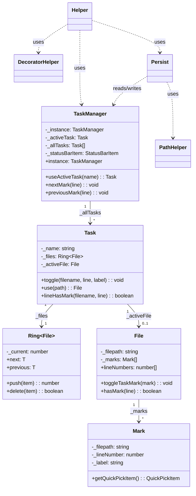
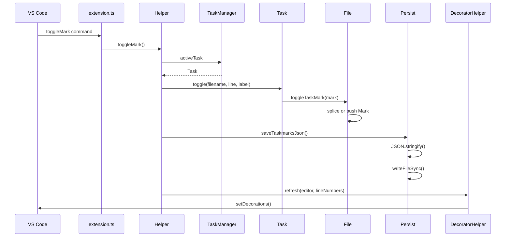
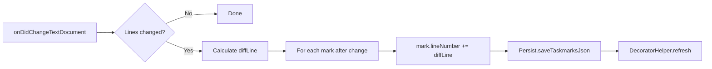
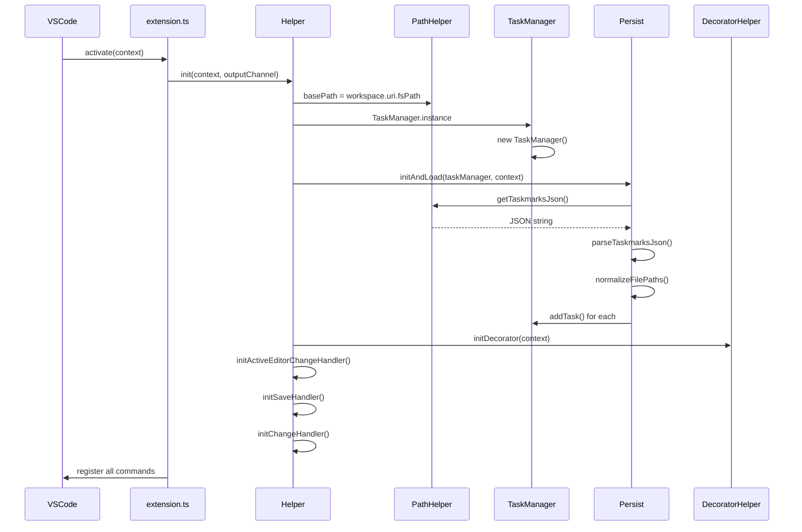

# Taskmarks Architecture

Technical overview of the VS Code extension for persistent, task-based bookmarks.

## File Structure

The extension is organized into three layers:

```
src/
├── extension.ts          # Entry point, command registration
├── Helper.ts             # VS Code event coordination
├── DecoratorHelper.ts    # Editor gutter icons
│
├── TaskManager.ts        # Singleton task orchestrator
│
├── Task.ts               # Task with Ring of files
├── File.ts               # File with array of marks
├── Mark.ts               # Single bookmark (line + label)
├── Ring.ts               # Circular array for navigation
│
├── Persist.ts            # JSON save/load operations
├── PathHelper.ts         # Path manipulation, file I/O
├── types.ts              # TypeScript interfaces
│
└── core/                 # Pure modules (no VS Code deps)
    ├── navigation.ts     # Mark navigation logic
    ├── serialization.ts  # JSON format conversion
    └── paths.ts          # Path utilities
```

**Layers:**
- **VS Code Integration**: `extension.ts`, `Helper.ts`, `DecoratorHelper.ts`
- **Business Logic**: `TaskManager.ts`
- **Data Structures**: `Task.ts`, `File.ts`, `Mark.ts`, `Ring.ts`
- **Persistence**: `Persist.ts`, `PathHelper.ts`
- **Pure Core**: `core/*.ts` (testable without VS Code)

---

## Class Hierarchy



---

## Data Flow: Toggle Bookmark

When a user presses `Ctrl+Alt+M`:



---

## Data Flow: Line Change Tracking

When document content changes, mark positions are automatically adjusted:



**Code location**: `Helper.initChangeHandler()` (lines 89-130)

```typescript
const diffLine = event.document.lineCount - lastLineCount;
allMarks.forEach((mark) => {
    if (mark.lineNumber > startLine) {
        mark.lineNumber = mark.lineNumber + diffLine;
    }
});
```

---

## The Ring Structure

Files within a task are stored in a `Ring<File>`, enabling circular navigation:

```
        ┌─────────┐
        │ File A  │
        └────┬────┘
             │
    ┌────────┴────────┐
    │                 │
┌───┴───┐         ┌───┴───┐
│File D │◄───────►│File B │ ◄── current
└───┬───┘         └───┬───┘
    │                 │
    └────────┬────────┘
             │
        ┌────┴────┐
        │ File C  │
        └─────────┘

.next     → moves clockwise
.previous → moves counter-clockwise
```

**Navigation logic** (in `TaskManager`):
1. `findNextMark()` looks for next line in current file
2. If none found → `nextDocument()` advances the Ring
3. Opens the next file with marks at its first mark

---

## Persistence Format

Data is stored in `.vscode/taskmarks.json`:

```typescript
interface IPersistTaskManager {
    activeTaskName: string;
    persistTasks: IPersistTask[];
}

interface IPersistTask {
    name: string;
    persistFiles: IPersistFile[];
}

interface IPersistFile {
    filepath: string;        // relative to workspace
    persistMarks: IPersistMark[];
}

interface IPersistMark {
    lineNumber: number;
    label: string;
}
```

**Example:**
```json
{
  "activeTaskName": "feature-auth",
  "persistTasks": [
    {
      "name": "feature-auth",
      "persistFiles": [
        {
          "filepath": "\\src\\auth\\login.ts",
          "persistMarks": [
            { "lineNumber": 42, "label": "TODO: validate token" },
            { "lineNumber": 87, "label": "" }
          ]
        }
      ]
    }
  ]
}
```

---

## Initialization Sequence



---

## Available Commands

| Command | Keybinding | Handler |
|---------|------------|---------|
| `toggleMark` | `Ctrl+Alt+M` | `Helper.toggleMark()` |
| `nextMark` | `Ctrl+Alt+N` | `Helper.nextMark()` |
| `previousMark` | `Ctrl+Alt+P` | `Helper.previousMark()` |
| `selectTask` | `Ctrl+Alt+T` | `Helper.selectTask()` |
| `createTask` | - | `Helper.createTask()` |
| `renameTask` | - | `Helper.renameTask()` |
| `deleteTask` | - | `Helper.deleteTask()` |
| `selectMarkFromList` | - | `Helper.selectMarkFromList()` |
| `copyToClipboard` | - | `Persist.copyToClipboard()` |
| `pasteFromClipboard` | - | `Persist.pasteFromClipboard()` |

---

## Pure Core Modules

The `core/` directory contains pure functions with no VS Code dependencies, enabling easier testing.

### core/navigation.ts

```typescript
findNextMark(currentLine: number, lineNumbers: number[]): number | undefined
findPreviousMark(currentLine: number, lineNumbers: number[]): number | undefined
findNextFileWithMarks(files, currentIndex): { filepath, lineNumber } | undefined
findPreviousFileWithMarks(files, currentIndex): { filepath, lineNumber } | undefined
```

### core/serialization.ts

```typescript
parseTaskmarksJson(json: string): IPersistTaskManager | null
taskToPersistTask(task, fileExistsCheck): IPersistTask
persistTaskToTask(persistTask): SerializableTask
normalizeFilePaths(persistTaskManager, fromChar, toChar): IPersistTaskManager
```

### core/paths.ts

```typescript
detectPathCharacters(path): { active: string, inactive: string }
getFullPath(basePath, filepath): string
reducePath(basePath, filepath): string
normalizePath(filepath, fromChar, toChar): string
```

---

## Key Design Decisions

1. **Singleton TaskManager**: Single source of truth for all task state
2. **Ring for file navigation**: Circular structure enables seamless prev/next across files
3. **Relative paths**: Stored paths are workspace-relative for portability
4. **Auto-save on document save**: Marks persist automatically
5. **Line tracking**: Marks adjust when lines are inserted/deleted above them
6. **Pure core modules**: Business logic separated from VS Code APIs for testability
