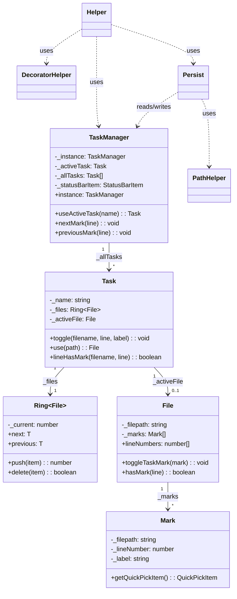
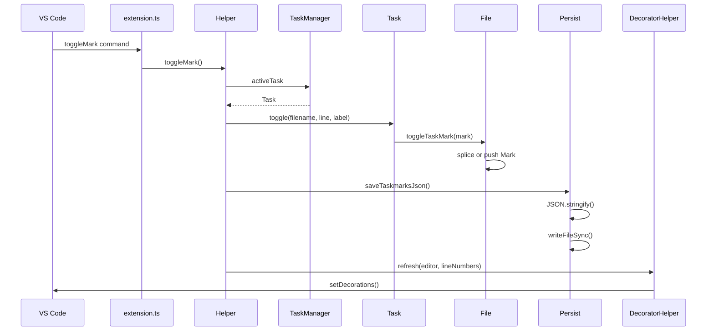
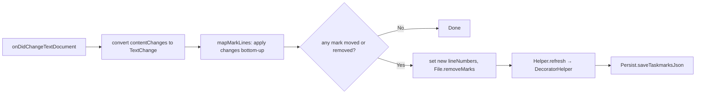
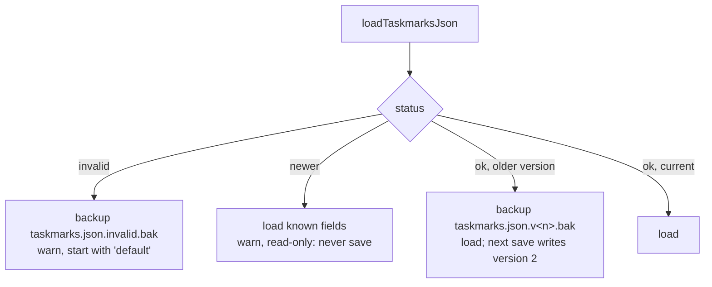
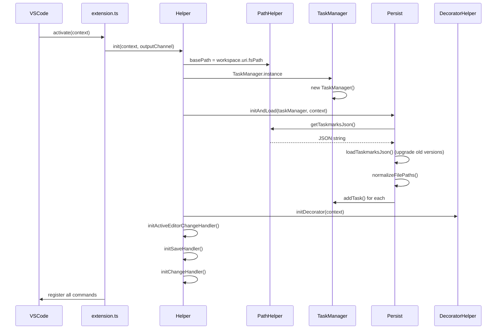

# Taskmarks Architecture

Technical overview of the VS Code extension for persistent, task-based bookmarks.

## File Structure

The extension is organized into three layers:

```
src/
├── extension.ts          # Entry point, command registration
├── Helper.ts             # VS Code event coordination
├── DecoratorHelper.ts    # Editor gutter icons
│
├── TaskManager.ts        # Singleton task orchestrator
│
├── Task.ts               # Task with Ring of files
├── File.ts               # File with array of marks
├── Mark.ts               # Single bookmark (line + label)
├── Ring.ts               # Circular array for navigation
│
├── Persist.ts            # JSON save/load operations
├── PathHelper.ts         # Path manipulation, file I/O
├── types.ts              # TypeScript interfaces
│
└── core/                 # Pure modules (no VS Code deps)
    ├── navigation.ts     # Mark navigation logic
    ├── serialization.ts  # JSON format conversion
    ├── migration.ts      # taskmarks.json versions + upgrade
    ├── lineAdjustment.ts # Move/remove marks on edits
    └── paths.ts          # Path utilities
```

**Layers:**
- **VS Code Integration**: `extension.ts`, `Helper.ts`, `DecoratorHelper.ts`
- **Business Logic**: `TaskManager.ts`
- **Data Structures**: `Task.ts`, `File.ts`, `Mark.ts`, `Ring.ts`
- **Persistence**: `Persist.ts`, `PathHelper.ts`
- **Pure Core**: `core/*.ts` (testable without VS Code)

---

## Class Hierarchy



---

## Data Flow: Toggle Bookmark

When a user presses `Ctrl+Alt+M`:



---

## Data Flow: Line Change Tracking

When document content changes, mark positions are adjusted from the edit itself. VS Code reports each change as the replaced range (in pre-edit coordinates) plus the inserted text, so no line count has to be remembered between events.



**Code location**: `Helper.initChangeHandler()` calls `mapMarkLines()` from `core/lineAdjustment.ts`.

Rules for one change (`mapLineThroughChange`):

| Marked line | Result |
|-------------|--------|
| above the change | unchanged |
| below the change | shifted by (inserted newlines − replaced lines) |
| strictly inside a multi-line range | removed |
| first line of the range | kept, unless deleted from column 0 to column 0 of a later line |
| last line of a multi-line range | kept (moved) only if the edit left it starting a line of its own, else removed (joined) |
| Enter at column 0 of the marked line | moves down with the text |

Marks that land outside the document or on a line another mark already has are removed. Removal is by `Mark` object, not by line number.

**Undo:** when a single-change edit removes marks, `Helper` keeps a `MarkRemoval` (start position, replaced and inserted line counts, the removed marks) per file, at most 20. On a change with `reason === Undo`, `findUndoneRemoval()` looks for a removal the undo exactly reverses (same start position, line counts swapped) and the marks are added back at their old lines. Redo needs no handling: it is the same delete again. The list lives in memory only.

---

## The Ring Structure

Files within a task are stored in a `Ring<File>`, enabling circular navigation:

```
        ┌─────────┐
        │ File A  │
        └────┬────┘
             │
    ┌────────┴────────┐
    │                 │
┌───┴───┐         ┌───┴───┐
│File D │◄───────►│File B │ ◄── current
└───┬───┘         └───┬───┘
    │                 │
    └────────┬────────┘
             │
        ┌────┴────┐
        │ File C  │
        └─────────┘

.next     → moves clockwise
.previous → moves counter-clockwise
```

**Navigation logic** (in `TaskManager`):
1. `findNextMark()` looks for next line in current file
2. If none found → `nextDocument()` advances the Ring
3. Opens the next file with marks at its first mark

---

## Persistence Format

Data is stored in `.vscode/taskmarks.json`:

```typescript
interface IPersistTaskManager {
    version?: number;        // 2 since 1.0.1, missing in older files
    activeTaskName: string;
    persistTasks: IPersistTask[];
}

interface IPersistTask {
    name: string;
    persistFiles: IPersistFile[];
}

interface IPersistFile {
    filepath: string;        // relative to workspace
    persistMarks: IPersistMark[];
}

interface IPersistMark {
    lineNumber: number;
    label: string;
}
```

**Example:**
```json
{
  "version": 2,
  "activeTaskName": "feature-auth",
  "persistTasks": [
    {
      "name": "feature-auth",
      "persistFiles": [
        {
          "filepath": "\\src\\auth\\login.ts",
          "persistMarks": [
            { "lineNumber": 42, "label": "TODO: validate token" },
            { "lineNumber": 87, "label": "" }
          ]
        }
      ]
    }
  ]
}
```

### Versions and upgrade

`core/migration.ts` reads every format the extension ever wrote and converts it to the current one:

| Version | Written by | Shape |
|---------|-----------|-------|
| 0 | 2018 – 0.8.13 | `tasks[].files[].marks: number[]` |
| 0 | 0.8.17 | `tasks[].files[].lineNumbers: number[]` |
| 0 | 0.8.21 | `persistTasks[].persistFiles[].lineNumbers: number[]` |
| 1 | 0.8.23 – 1.0.0 | `persistTasks[].persistFiles[].persistMarks: {lineNumber, label}[]` |
| 2 | 1.0.1 | version 1 + `"version": 2` |

What `Persist.initAndLoad` does with the result of `loadTaskmarksJson()`:



To add a version 3 (e.g. breakpoints per task): raise `CURRENT_VERSION`, add the new optional fields to the types and to `upgradeTask`, and add a test with a version 2 file.

---

## Initialization Sequence



---

## Available Commands

| Command | Keybinding | Handler |
|---------|------------|---------|
| `toggleMark` | `Ctrl+Alt+M` | `Helper.toggleMark()` |
| `nextMark` | `Ctrl+Alt+N` | `Helper.nextMark()` |
| `previousMark` | `Ctrl+Alt+P` | `Helper.previousMark()` |
| `selectTask` | `Ctrl+Alt+T` | `Helper.selectTask()` |
| `createTask` | - | `Helper.createTask()` |
| `renameTask` | - | `Helper.renameTask()` |
| `deleteTask` | - | `Helper.deleteTask()` |
| `selectMarkFromList` | - | `Helper.selectMarkFromList()` |
| `copyToClipboard` | - | `Persist.copyToClipboard()` |
| `pasteFromClipboard` | - | `Persist.pasteFromClipboard()` |

---

## Pure Core Modules

The `core/` directory contains pure functions with no VS Code dependencies, enabling easier testing.

### core/navigation.ts

```typescript
findNextMark(currentLine: number, lineNumbers: number[]): number | undefined
findPreviousMark(currentLine: number, lineNumbers: number[]): number | undefined
findNextFileWithMarks(files, currentIndex): { filepath, lineNumber } | undefined
findPreviousFileWithMarks(files, currentIndex): { filepath, lineNumber } | undefined
```

### core/serialization.ts

```typescript
taskToPersistTask(task, fileExistsCheck): IPersistTask
persistTaskToTask(persistTask): SerializableTask
normalizeFilePaths(persistTaskManager, fromChar, toChar): IPersistTaskManager
```

### core/migration.ts

```typescript
CURRENT_VERSION = 2
loadTaskmarksJson(json): { status: 'ok' | 'newer', data, fromVersion } | { status: 'invalid', reason }
upgradeTask(value): IPersistTask | undefined   // also used for clipboard paste
detectVersion(raw): number
```

### core/lineAdjustment.ts

```typescript
mapLineThroughChange(line, change: TextChange): number | undefined
mapMarkLines(lines, changes: TextChange[], newLineCount): (number | undefined)[]
```

### core/paths.ts

```typescript
detectPathCharacters(path): { active: string, inactive: string }
getFullPath(basePath, filepath): string
reducePath(basePath, filepath): string
normalizePath(filepath, fromChar, toChar): string
```

---

## Key Design Decisions

1. **Singleton TaskManager**: Single source of truth for all task state
2. **Ring for file navigation**: Circular structure enables seamless prev/next across files
3. **Relative paths**: Stored paths are workspace-relative for portability
4. **Auto-save on document save**: Marks persist automatically
5. **Line tracking**: Marks adjust when lines are inserted/deleted above them
6. **Pure core modules**: Business logic separated from VS Code APIs for testability
