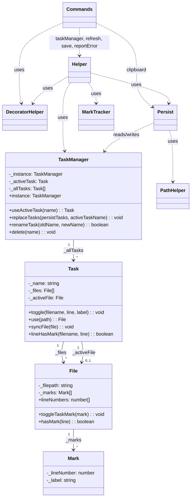
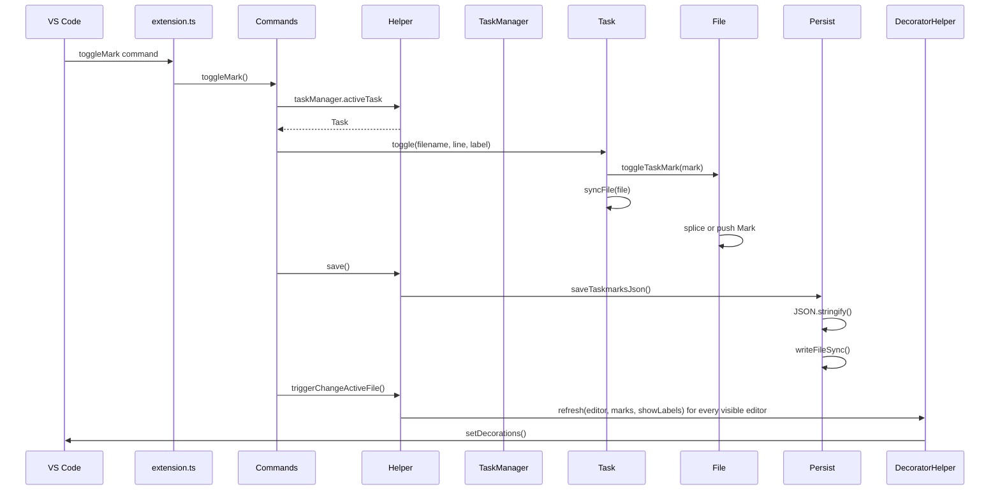
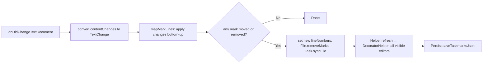
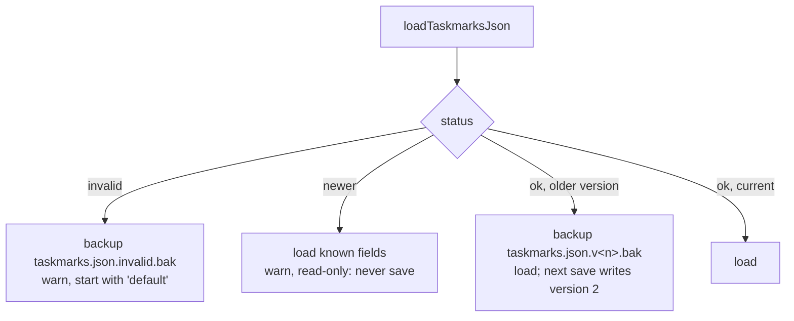
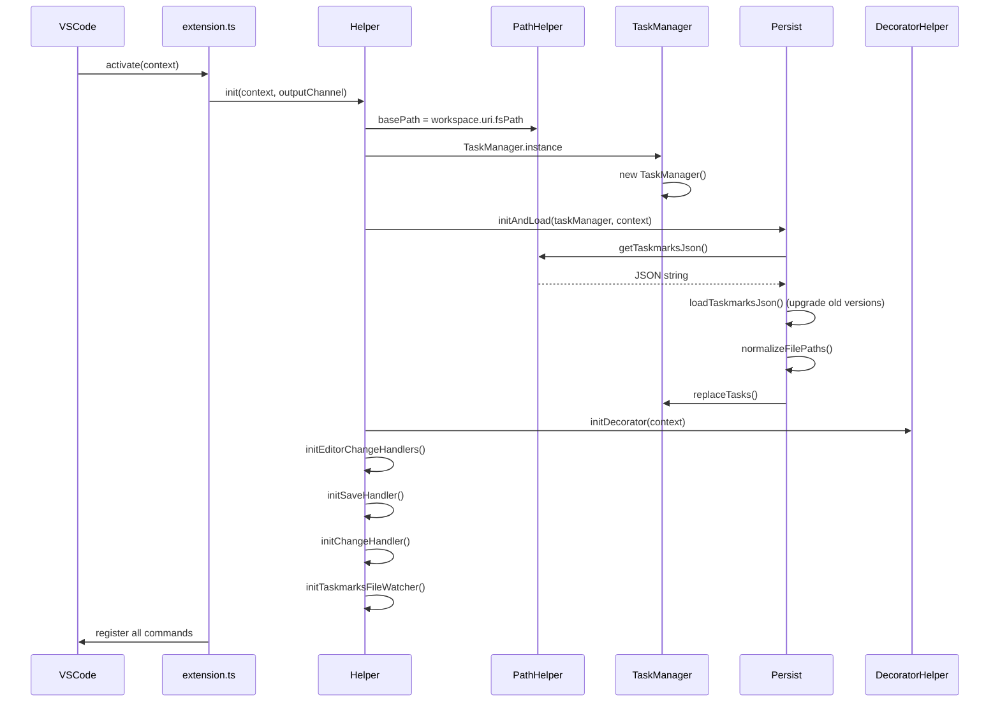

# Taskmarks Architecture

Technical overview of the VS Code extension for persistent, task-based bookmarks.

## File Structure

The extension is organized into three layers:

```
src/
├── extension.ts          # Entry point, command registration
├── Commands.ts           # The commands (toggle, next / previous, lists, tasks, clipboard)
├── Helper.ts             # Wiring: load, editor and file events, status bar, save
├── MarkTracker.ts        # Moves marks with edits, restores them on undo
├── DecoratorHelper.ts    # Editor gutter icons, jump to a line
│
├── TaskManager.ts        # Singleton: all tasks and the active one
│
├── Task.ts               # Task with array of files
├── File.ts               # File with array of marks
├── Mark.ts               # Single bookmark (line + label)
│
├── Persist.ts            # JSON save/load operations
├── PathHelper.ts         # Path manipulation, file I/O
├── types.ts              # TypeScript interfaces
│
└── core/                 # Pure modules (no VS Code deps)
    ├── navigation.ts     # Mark navigation logic
    ├── labels.ts         # Labels of two marks on one line: conflict, combine
    ├── errors.ts         # Message and stack of whatever was thrown
    ├── serialization.ts  # JSON format conversion
    ├── migration.ts      # taskmarks.json versions + upgrade
    ├── lineAdjustment.ts # Move/remove marks on edits
    └── paths.ts          # Path utilities
```

**Layers:**
- **VS Code Integration**: `extension.ts`, `Commands.ts`, `Helper.ts`, `MarkTracker.ts`, `DecoratorHelper.ts`
- **Business Logic**: `TaskManager.ts` (no `vscode` import: tasks, the active task, rename, delete)
- **Data Structures**: `Task.ts`, `File.ts`, `Mark.ts` (`File` and `Mark` import neither `vscode` nor the helpers; `Task` only uses `PathHelper` to make paths workspace-relative)
- **Persistence**: `Persist.ts`, `PathHelper.ts`
- **Pure Core**: `core/*.ts` (testable without VS Code)

---

## Class Hierarchy



---

## Data Flow: Toggle Bookmark

When a user presses `Alt+Shift+M`:



---

## Data Flow: Line Change Tracking

When document content changes, mark positions are adjusted from the edit itself. VS Code reports each change as the replaced range (in pre-edit coordinates) plus the inserted text, so no line count has to be remembered between events.



**Code location**: `Helper.documentChanged()` hands the event to `MarkTracker.documentChanged()`, which calls `mapMarkLines()` from `core/lineAdjustment.ts` once per task (`MarkTracker.adjustMarks()`) and says whether any mark changed. Only then does `Helper` refresh the editors and save.

**Which changes are seen:** VS Code reports the changes of every open document, so the marks of a file are adjusted in **every task** and whether or not the file is in the active editor: typing, rename and replace across files, format on save, and the reload of an open file that changed on disk (reported as one change that replaces the lines that differ, so marks strictly inside that block are removed). A file that changes while it is **not open** in VS Code (a pull or checkout of a closed file, another program) is not reported at all. Its marks keep their line numbers; fixing that would need the text of the marked line in taskmarks.json, i.e. a new format version.

Rules for one change (`mapLineThroughChange`):

| Marked line | Result |
|-------------|--------|
| above the change | unchanged |
| below the change | shifted by (inserted newlines − replaced lines) |
| strictly inside a multi-line range | removed |
| first line of the range | kept, unless deleted from column 0 to column 0 of a later line |
| last line of a multi-line range | kept (moved) only if the edit left it starting a line of its own, else removed (joined) |
| Enter at column 0 of the marked line | moves down with the text |

Marks that land outside the document or on a line another mark already has are removed. Removal is by `Mark` object, not by line number.

**Undo:** when a single-change edit removes marks, `MarkTracker` keeps a `MarkRemoval` (start position, replaced and inserted line counts, the removed marks) per task and file path, at most 20 each. The path is the key, not the `File`: a file that loses its last mark leaves its task, and `Task.getOrCreateFile()` brings it back for the restored marks. On a change with `reason === Undo`, `findUndoneRemoval()` looks for a removal the undo exactly reverses (same start position, line counts swapped) and the marks are added back at their old lines. Redo needs no handling: it is the same delete again. The list lives in memory only.

---

## Navigation Across Files

`Task.files` is a plain `File[]` and holds only files that have marks, in the order they got their first mark. `Task.syncFile(file)` keeps it that way: it adds a file with its first mark and removes it with its last. `toggle()` and `mergeFilesWithPersistFiles()` call it themselves; code that changes a file's marks directly (`MarkTracker`) has to call it.

`Task.activeFile` is the file in the active editor, set by `use()` on every editor change. It is only the starting point for next / previous: the gutter icons are set for every visible editor (`Helper.refresh()`), and edits are tracked for every open document. While it has no marks it is not part of `files`. When it gets a mark, the same `File` object is added, so the editor and the task never work on two objects for one path.

There is no stored cursor: the position is always derived from `activeFile`. If the active file has no marks, navigation starts at the first (next) or last (previous) file of the task. The same happens when no text editor is active (all editors closed, or the active tab is not a text file): there is no cursor to start from, although `activeFile` still names the file that was used last.

**Navigation logic** (in `Commands.nextMark()` / `Commands.nextDocument()`):
1. `findNextMark()` looks for the next marked line in the active file
2. If none found → `nextDocument()` calls `findNextFileWithMarks(files, indexOfActiveFile)` from `core/navigation.ts`
3. That walks the array once from the file after the active one, wrapping around, skips files without marks, and checks the active file last (so a task with marks in one file wraps to that file's first mark)
4. The result is opened at its first mark; if no file has marks, nothing happens

`previousMark()` / `previousDocument()` mirror this with `findPreviousMark()` / `findPreviousFileWithMarks()` and open the previous file at its last mark.

---

## Persistence Format

Data is stored in `.vscode/taskmarks.json` (or, with `taskmarks.useGlobalTaskmarksJson` and no such file, in `taskmarks.json` in VS Code's storage folder for the workspace, `context.storageUri`):

```typescript
interface IPersistTaskManager {
    version?: number;        // 2 since 1.0.1, missing in older files
    activeTaskName: string;
    persistTasks: IPersistTask[];
}

interface IPersistTask {
    name: string;
    persistFiles: IPersistFile[];
}

interface IPersistFile {
    filepath: string;        // relative to workspace, with \ or / (see "Path separators")
    persistMarks: IPersistMark[];
}

interface IPersistMark {
    lineNumber: number;
    label: string;
}
```

**Example:**
```json
{
  "version": 2,
  "activeTaskName": "feature-auth",
  "persistTasks": [
    {
      "name": "feature-auth",
      "persistFiles": [
        {
          "filepath": "\\src\\auth\\login.ts",
          "persistMarks": [
            { "lineNumber": 42, "label": "TODO: validate token" },
            { "lineNumber": 87, "label": "" }
          ]
        }
      ]
    }
  ]
}
```

### Versions and upgrade

`core/migration.ts` reads every format the extension ever wrote and converts it to the current one:

| Version | Written by | Shape |
|---------|-----------|-------|
| 0 | 2018 – 0.8.13 | `tasks[].files[].marks: number[]` |
| 0 | 0.8.17 | `tasks[].files[].lineNumbers: number[]` |
| 0 | 0.8.21 | `persistTasks[].persistFiles[].lineNumbers: number[]` |
| 1 | 0.8.23 – 1.0.0 | `persistTasks[].persistFiles[].persistMarks: {lineNumber, label}[]` |
| 2 | 1.0.1 – 1.2.0 | version 1 + `"version": 2` |

What `Persist.initAndLoad` does with the result of `loadTaskmarksJson()`:



### Labels

A label belongs to one mark (`IPersistMark.label`, `''` for none). It is set when a mark is toggled (only asked for with `taskmarks.enableLabel`) and changed with `Commands.editLabel()`.

Where it is shown: as the entry text in "Select Bookmark from List", and as faded text at the end of the marked line (`DecoratorHelper.refresh()`, an `after` decoration; `taskmarks.showLabelInEditor`). It can't be shown on hovering the gutter icon: VS Code shows the hover text of an extension's decoration only over text, never over its gutter icon.

When marks are merged into a line that already has a mark (`File.mergeMarks`, rules in `core/labels.ts`): a mark without label takes over the other label, and a label is never removed. If both have a label and the labels differ, the caller's `LabelConflictChoice` decides: `keep` (default; used for load and for undo), `take` or `combine` ("mine / theirs", without repeating a label that is already contained). "Paste Task from Clipboard" counts these conflicts first (`TaskManager.countLabelConflicts`) and asks once for all of them; cancelling the question cancels the paste.

### Menu of the line numbers

A gutter icon is a decoration; an extension can't attach a menu or a click to it. What VS Code offers (since 1.78, hence `engines.vscode`) is the menu `editor/lineNumber/context` for a right-click on a line number or in the margin next to it, where the icon is. `package.json` puts two commands there, both hidden from the command palette because they need the clicked line:

- `taskmarks.toggleMarkAtLine` on every line,
- `taskmarks.editLabelAtLine` only where `editorLineNumber in taskmarks.markedLines` holds.

VS Code calls them with `{ lineNumber, uri }` (`LineMenuTarget`), the line counted from 1. `taskmarks.markedLines` is a context key that `Helper.refresh()` sets to the marked lines (from 1) of all visible editors together. It is one list for the window, so with two files side by side "Edit Bookmark Label" can be offered on a line that is only marked in the other file; the command then says that the line has no bookmark.

### Path separators

In memory, file paths have the separator of the system VS Code runs on (`normalizeFilePaths` on load). In the file they keep the separator the file already uses (`detectFileSeparator`, the one more paths have; `Persist._fileSeparator`), and a new file is written with `/`. Otherwise a team on Windows and macOS / Linux would rewrite every path with every save. This is not a new format version: every version since 0.8 reads both separators.

### Marks of files that don't exist

Saving does not check whether a marked file exists. The file may exist for a teammate or on another branch, and taskmarks.json is shared. Stale entries stay until the marks are removed by hand.

Such files stay in `Task.files`, so everything that opens files has to leave them out (`PathHelper.fileExists`): next / previous across files (`Commands.filesOnDisk`) and the bookmark list (`Commands.getMarkQuickPickItems`).

### Changes from outside (pull, checkout, editing the file)

`Helper.initTaskmarksFileWatcher()` watches taskmarks.json and calls `Persist.reloadIfChangedOnDisk()` 300 ms after the last change:

| The file on disk | Result |
|------------------|--------|
| is what was last loaded or saved (own write), or is gone | nothing |
| can be read, no unsaved changes | the tasks are **replaced** by the file's (`TaskManager.replaceTasks`), not merged: a merge could not remove marks. The own active task stays active if it still exists |
| can be read, but there are unsaved changes | ask: "Load the file" / "Keep my bookmarks" (saves over the file). Dismissed: nothing, the next save writes |
| can't be read (e.g. conflict markers) | keep the tasks, warn, and save nothing (`Persist._fileUnreadable`) until the file can be read again or the user picks "Overwrite with my bookmarks" (backup `taskmarks.json.invalid.bak` first) |

Unsaved changes are rare, because every change is saved at once: they exist after a failed write or while saving was held back. They are detected by comparing the serialized tasks with `Persist._syncedTaskmarksJson`, the serialization at the last load or save.

After a reload all `Task`, `File` and `Mark` objects are new. `Helper.taskmarksFileChanged()` therefore uses the active editor's file again and clears the remembered mark removals (undo).

To add a version 3 (e.g. breakpoints per task): raise `CURRENT_VERSION`, add the new optional fields to the types and to `upgradeTask`, and add a test with a version 2 file.

---

## Initialization Sequence



---

## Available Commands

| Command | Keybinding | Handler |
|---------|------------|---------|
| `toggleMark` | `Alt+Shift+M` | `Commands.toggleMark()` |
| `editLabel` | - | `Commands.editLabel()` |
| `toggleMarkAtLine` | right-click on a line number | `Commands.toggleMarkAtLine(target)` |
| `editLabelAtLine` | right-click on a line number with a mark | `Commands.editLabelAtLine(target)` |
| `nextMark` | `Alt+Shift+N` | `Commands.nextMark()` |
| `previousMark` | `Alt+Shift+P` | `Commands.previousMark()` |
| `selectTask` | `Alt+Shift+T` | `Commands.selectTask()` |
| `createTask` | - | `Commands.createTask()` |
| `renameTask` | - | `Commands.renameTask()` |
| `deleteTask` | - | `Commands.deleteTask()` |
| `selectMarkFromList` | `Alt+Shift+L` | `Commands.selectMarkFromList()` |
| `copyToClipboard` | - | `Commands.copyToClipboard()` |
| `pasteFromClipboard` | - | `Commands.pasteFromClipboard()` |

---

## Pure Core Modules

The `core/` directory contains pure functions with no VS Code dependencies, enabling easier testing.

### core/navigation.ts

```typescript
findNextMark(currentLine: number, lineNumbers: number[]): number | undefined
findPreviousMark(currentLine: number, lineNumbers: number[]): number | undefined
findNextFileWithMarks(files, currentIndex): { filepath, lineNumber } | undefined
findPreviousFileWithMarks(files, currentIndex): { filepath, lineNumber } | undefined
```

### core/serialization.ts

```typescript
taskToPersistTask(task, fileExistsCheck): IPersistTask   // Persist passes no check: files missing on disk are kept
normalizeTaskFilePaths(persistTask, fromChar, toChar): IPersistTask   // used for clipboard paste
persistTaskToTask(persistTask): SerializableTask
normalizeFilePaths(persistTaskManager, fromChar, toChar): IPersistTaskManager
detectFileSeparator(persistTaskManager): '/' | '\\' | undefined
```

### core/migration.ts

```typescript
CURRENT_VERSION = 2
loadTaskmarksJson(json): { status: 'ok' | 'newer', data, fromVersion } | { status: 'invalid', reason }
upgradeTask(value): IPersistTask | undefined   // also used for clipboard paste
detectVersion(raw): number
```

### core/lineAdjustment.ts

```typescript
mapLineThroughChange(line, change: TextChange): number | undefined
mapMarkLines(lines, changes: TextChange[], newLineCount): (number | undefined)[]
```

### core/paths.ts

```typescript
detectPathCharacters(path): { active: string, inactive: string }
getFullPath(basePath, filepath): string
reducePath(basePath, filepath): string
isInsideBasePath(basePath, filepath): boolean   // marks are only set in such files
normalizePath(filepath, fromChar, toChar): string
```

---

## Key Design Decisions

1. **Singleton TaskManager**: Single source of truth for all task state
2. **No navigation cursor**: prev/next across files is computed from the active file, so it cannot drift from the editor
3. **Relative paths**: Stored paths are workspace-relative for portability. A file outside the (first) workspace folder can't be stored that way, so `Commands.toggleMark()` refuses to set a mark there
4. **Auto-save on document save**: Marks persist automatically
5. **Line tracking**: Marks adjust when lines are inserted/deleted above them
6. **Pure core modules**: Business logic separated from VS Code APIs for testability
7. **UI stays out of the model**: `TaskManager`, `Task`, `File` and `Mark` don't import `vscode`. The status bar is set in `Helper.refresh()`, next / previous are in `Commands`, and the entries of "Select Bookmark from List" are built in `Commands.getMarkQuickPickItems()`, fresh on every call (one `openTextDocument` per file). Each entry carries its `Mark`, so the jump uses the mark's current line instead of text parsed back from the entry
8. **Commands await and report**: every command in `Commands` is `async`, awaits its prompts and reports errors with `Helper.reportError` instead of throwing. Cancelling a prompt changes and saves nothing; "Delete Task" asks before bookmarks are lost
